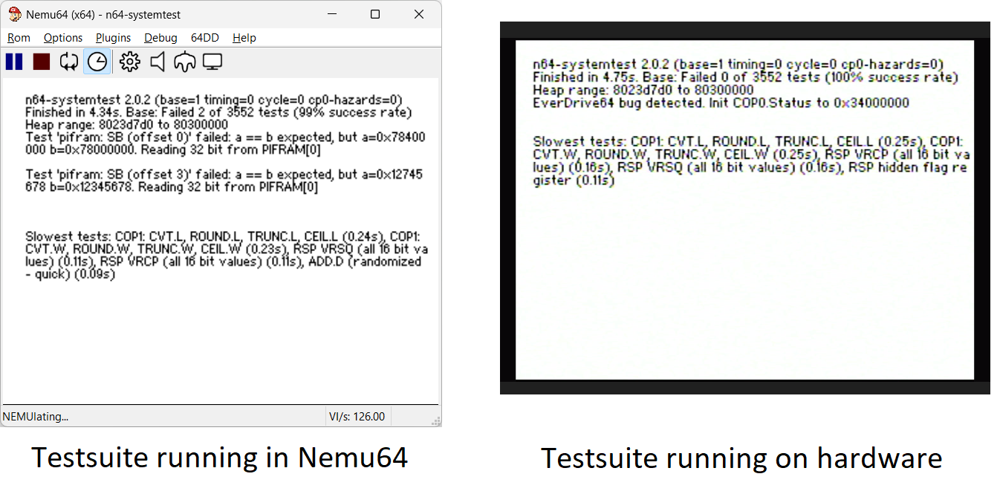

# Test everything

How do you know what to put into an emulator? What should happen if e.g. certain instruction is being executed? For the 2000-era Nemu64, we deployed three strategies:
* For the main CPU (which is a standard part with public documentation): Read the manual,
* Run existing code, find things that don't work, debug and experiment a lot and fix things,
* Run tests on hardware and put the results into the emulator or into a doc.

 The above approaches have a few downsides:
 * Documentation can be incorrect or incomplete.
 * Fixing bugs can feel like playing Whac-A-Mole: Fix one thing here and some other thing break there.
 * Knowledge gets lost: While some emulator might get some detail right, the next emulator won't know about it.

By following the above, the world ends up with a lot of emulators in which each one emulator gets some things right and others wrong. For example, the old Nemu
(which certainly wasn't a shining example of overall correctness) was the only emulator in 2020 to correctly read bytes from ROM; the knowledge that the hardware
has a weird quirk here was completely forgotten until recently. (Sidenote: This is less of a problem with modern open source software but still true for things that
are easily overlooked or that are difficult to get right).

There has been progress on that problem in general: Two fantastic projects in particular are
Peter Lemon's [N64 tests](https://github.com/PeterLemon/N64) and Dillon Beliveau's [rsp-ruination](https://github.com/Dillonb/rsp-ruination). As both of these tests can be
run on hardware and in an emulator, they have been helping bring up overall emulator accuracy. And they will still be useful in decades to come, long after the current
set of emulators is extinct.

The downside of the test roms above is that they are not complete: Both of them test a tiny part of the console only. We need more of that.

So that's what I set out to build: A test suite that tests as much of the console as possible. This way I could ensure that nothing ended up in Nemu64 that
wasn't first verified to be correct on hardware.

But at the same time it also helps other emulators be more accurate. The test suite is actually the only part of the new Nemu64 that has already been released
and plenty of other emulators have already started fixing the bugs or inconsistencies that were discovered.

Available at: https://github.com/lemmy-64/n64-systemtest

